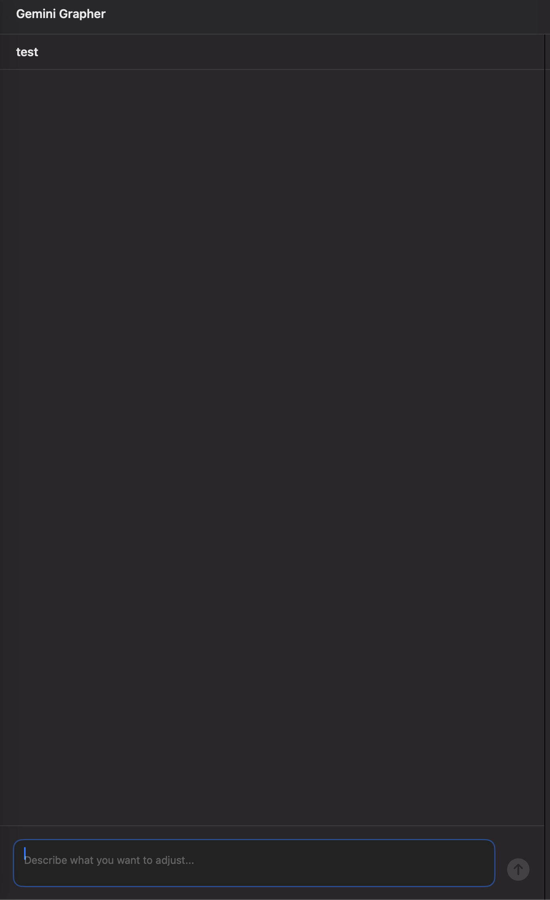

<p align="center">
  
</p>

<h1 align="center">Gemini Grapher</h1>

<p align="center">
  A macOS app for iteratively refining Gemini image generation prompts through conversational LLM interaction, powered by <a href="https://github.com/zhaolongzhong/vibeproxy">vibeproxy</a>.
</p>

<p align="center">
  <a href="https://github.com/futurepnp-hugot/gemini-grapher/releases/latest">
    
  </a>
  
  
</p>

<p align="center">
  
</p>

---

## What is Gemini Grapher?

Gemini Grapher helps you craft the perfect image generation prompt through a conversational workflow. Instead of manually tweaking prompts, you describe what you want in natural language, and the app iteratively builds and refines a detailed prompt for you.

**How it works:**

1. Start a session and describe what kind of image you want
2. The LLM generates a detailed prompt and explains its choices
3. Tell it what to adjust — style, composition, colors, mood, etc.
4. Each iteration produces a new prompt version you can copy and use
5. Browse version history to compare or resume from any point

## Features

- **Conversational prompt refinement** — Chat naturally to iteratively improve prompts
- **Version tracking** — Every prompt revision is saved; browse and compare versions
- **Prompt preview panel** — See the current prompt in a dedicated side panel with one-click copy
- **Memory system** — Save style preferences and session feedback to guide future sessions
- **Streaming responses** — Real-time SSE streaming for responsive interaction
- **Markdown rendering** — Rich message display with full Markdown support
- **Session management** — Create, rename, and organize multiple prompt sessions

## Prerequisites: vibeproxy

Gemini Grapher connects to LLMs through [vibeproxy](https://github.com/zhaolongzhong/vibeproxy), a lightweight proxy that provides an OpenAI-compatible API for various LLM providers (including Google Gemini).

### Setting up vibeproxy

1. Install vibeproxy:

   ```bash
   pip install vibeproxy
   ```

2. Start the proxy with your API key:

   ```bash
   # For Google Gemini
   export GOOGLE_API_KEY=your-api-key
   vibeproxy --port 8317

   # Or for other providers (OpenAI, Anthropic, etc.)
   export OPENAI_API_KEY=your-api-key
   vibeproxy --port 8317
   ```

3. vibeproxy will be available at `http://localhost:8317` with an OpenAI-compatible `/v1/chat/completions` endpoint.

> Gemini Grapher defaults to `http://localhost:8317`. You can change the URL and select your preferred model in **Settings** (`Cmd+,`).

## Installation

### Download

Download the latest `.dmg` from the [Releases](https://github.com/futurepnp-hugot/gemini-grapher/releases/latest) page.

### Build from source

```bash
git clone https://github.com/futurepnp-hugot/gemini-grapher.git
cd gemini-grapher/GeminiGrapher
swift build -c release
```

The binary will be at `.build/release/GeminiGrapher`.

## Usage

1. Make sure vibeproxy is running (`vibeproxy --port 8317`)
2. Launch Gemini Grapher
3. Open **Settings** (`Cmd+,`) to verify the vibeproxy URL and select a model
4. Click **+** to create a new session
5. Describe the image you want — the assistant will generate a detailed prompt
6. Copy the prompt from the right panel and paste it into Gemini's image generator
7. Tell the assistant what to adjust, and it will refine the prompt incrementally

## Tech Stack

| Layer | Technology |
|-------|-----------|
| Language | Swift 5.9 |
| UI | SwiftUI (NavigationSplitView, three-column) |
| Persistence | SwiftData |
| Markdown | [swift-markdown-ui](https://github.com/gonzalezreal/swift-markdown-ui) |
| LLM Backend | [vibeproxy](https://github.com/zhaolongzhong/vibeproxy) (OpenAI-compatible API) |
| Build | Swift Package Manager |

## License

MIT
